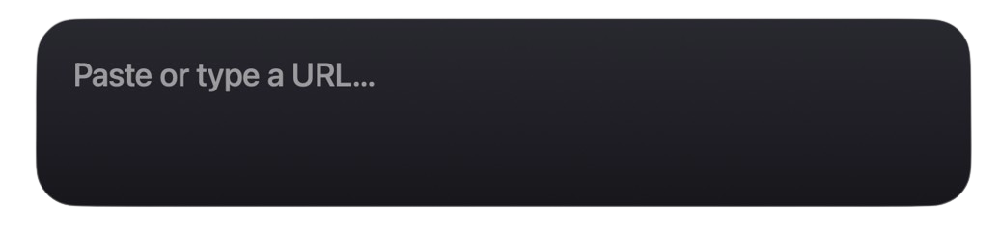
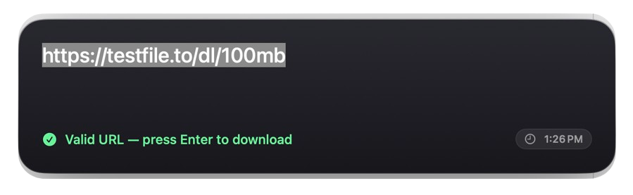
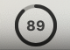

<div align="center">

# DownloadShortcut

**A quick-download menu bar app for macOS.**

Press a global shortcut anywhere on your Mac, confirm the link, and the file lands in
`~/Downloads` in seconds — no browser, no waiting for a page to load.

[](#requirements)
[](#requirements)
[](LICENSE)

</div>

## Contents

- [Demo](#demo)
- [Features](#features)
- [How it works](#how-it-works)
- [Installation](#installation)
- [Settings](#settings)
- [Building from source](#building-from-source)
- [Architecture](#architecture)
- [Contributing](#contributing)
- [License](#license)

## Demo

<p align="center">
  <br>
  <sub>Press the shortcut, and the popup appears ready for a URL.</sub>
</p>

<p align="center">
  <br>
  <sub>Paste or type a link — it's validated instantly.</sub>
</p>

<p align="center">
  <br>
  <sub>The menu bar icon turns into a live progress ring while downloading.</sub>
</p>

## Features

- **Global shortcut, anywhere** — configurable in Settings (default `⌥⌘V`), works from
  any app.
- **Clipboard-aware popup** — pops up centered on screen, pre-filled with a URL found
  and normalized from whatever you last copied (including protocol-relative links and
  URLs buried inside JSON). Paste or type one URL, or several on separate lines to
  queue them all at once.
- **Skip the popup entirely** — optionally download immediately when the clipboard
  already has a valid URL, only falling back to the popup when it doesn't.
- **Concurrent download queue** — several downloads run at once (default 3,
  configurable); extras wait their turn.
- **Live tray progress** — the menu bar icon becomes a circular progress ring with a
  percentage while downloading, plus a small badge showing how many are running
  concurrently.
- **Cancel from the menu bar** — cancel a single active download directly, or pick
  which one from a list when several are running.
- **History, one click away** — recent downloads with "Open" and "Show in Finder",
  right from the tray menu.
- **Notifications** — an optional notification (and sound) when a download finishes;
  click it to reveal the file in Finder.
- **Launch at login** — optional, via `ServiceManagement`.

## How it works

1. Press your configured shortcut from anywhere on the system.
2. A popup appears with a URL already filled in, pulled from your clipboard.
3. Press <kbd>Enter</kbd> to start the download, or <kbd>Esc</kbd> to dismiss.
4. Watch progress in the menu bar; open the finished file (or reveal it in Finder)
   from the tray menu once it's done.

## Installation

DownloadShortcut isn't notarized or distributed as a signed release yet, so for now
it's build-from-source only — see [Building from source](#building-from-source) below.

## Settings

Settings is a tabbed preferences window (opened via "Settings…" in the tray menu):

| Tab       | Contains                                                                |
| --------- | ------------------------------------------------------------------------ |
| General   | Launch at login, skip-the-popup auto-download                            |
| Shortcut  | The global shortcut recorder                                             |
| Downloads | Max concurrent downloads, completion notification/sound, clear history   |
| About     | App version and a quick feature overview                                 |

## Building from source

Business logic (all TCA reducers, effects, and dependency clients) lives in a plain
Swift package under `Sources/`, fully unit-tested and buildable with the Swift
toolchain alone — no Xcode required:

```sh
swift build
swift test
```

> **Only have Xcode Command Line Tools, not full Xcode?** `swift test` needs Swift
> Testing's runtime framework, which lives outside the default search path when Xcode
> itself isn't installed. If you hit `no such module 'Testing'` or a `dlopen` failure
> for `Testing.framework`, run:
> ```sh
> swift test \
>   -Xswiftc -F -Xswiftc /Library/Developer/CommandLineTools/Library/Developer/Frameworks \
>   -Xlinker -F -Xlinker /Library/Developer/CommandLineTools/Library/Developer/Frameworks \
>   -Xlinker -rpath -Xlinker /Library/Developer/CommandLineTools/Library/Developer/Frameworks \
>   -Xlinker -rpath -Xlinker /Library/Developer/CommandLineTools/Library/Developer/usr/lib
> ```
> With full Xcode installed, plain `swift test` works with no extra flags.

The `App/` directory holds the thin AppKit "shell" — the status bar item, the popup
panel, window/entitlements/Info.plist glue — that needs a real macOS GUI session and
Xcode to build and run. It's generated into an `.xcodeproj` via
[XcodeGen](https://github.com/yonaskolb/XcodeGen) rather than hand- or Xcode-edited, so
the project file stays diffable and reproducible:

```sh
brew install xcodegen   # if you don't have it
xcodegen generate
open DownloadShortcut.xcodeproj
```

Then build & run the `DownloadShortcut` scheme in Xcode.

### Dependencies

- [swift-composable-architecture](https://github.com/pointfreeco/swift-composable-architecture) — app architecture.
- [KeyboardShortcuts](https://github.com/sindresorhus/KeyboardShortcuts) — global hotkey capture and recorder UI.
  Pinned below `1.16.0` in `Package.swift`: newer releases use the `#Preview` macro,
  which needs Xcode's PreviewsMacros plugin and won't build with only Command Line
  Tools. Safe to bump once you've confirmed a build against full Xcode.

### Requirements

- macOS 14 Sonoma or later
- Swift 6 toolchain
- Xcode (for building/running the app shell; the `Sources/` package builds without it)

### Distribution notes

This app targets direct (non–App Store) distribution: sign with a Developer ID and
notarize before sharing a build. It is **not sandboxed**, which keeps global hotkeys
and writing to `~/Downloads` simple with no extra entitlements or security-scoped
bookmarks.

## Architecture

Built with [The Composable Architecture](https://github.com/pointfreeco/swift-composable-architecture)
(TCA): unidirectional state, reducers, and effects, with every dependency (clipboard,
downloads, notifications, the global hotkey, persistence) injected via `@Dependency`
so the whole feature set is unit-testable without touching real AppKit state.

```
Sources/
├── SharedModels/         Domain types: DownloadRecord, DownloadStatus, AppSettings
├── ClipboardClient/       @Dependency wrapping NSPasteboard
├── HotkeyClient/          @Dependency wrapping the global hotkey library
├── DownloadClient/        @Dependency: URLSession downloads, streamed progress
├── HistoryClient/         @Dependency: persists download history to disk
├── FileActionsClient/     @Dependency: open / reveal-in-Finder
├── QuickAddFeature/        The popup: clipboard-seeded URL entry + validation
├── DownloadQueueFeature/   The download queue, concurrency cap, cancellation
├── StatusBarFeature/       Tray icon state machine (idle/downloading/finished)
├── HistoryFeature/         Recent-downloads list
├── SettingsFeature/        Preferences (shortcut, concurrency, notifications, …)
└── AppFeature/              Root reducer composing all of the above
```

`App/` is the thin AppKit/SwiftUI shell (status item, popup window, settings window,
app delegate) that hosts `AppFeature`'s views — deliberately kept small since it can't
be unit-tested the same way.

## Contributing

Issues and pull requests are welcome. Before opening a PR:

```sh
swift build
swift test
```

should both pass. Please keep changes to `App/` minimal and push logic down into the
`Sources/` package where it can be tested.

## License

[MIT](LICENSE) — see the `LICENSE` file for the full text.
